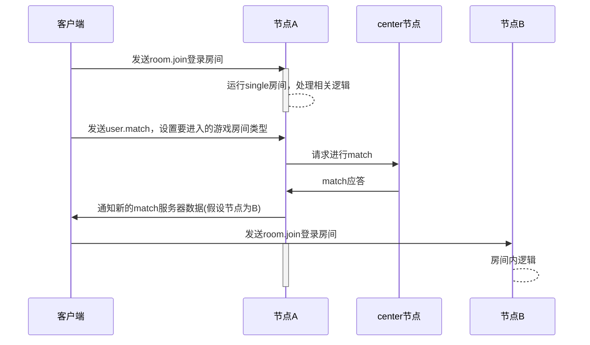
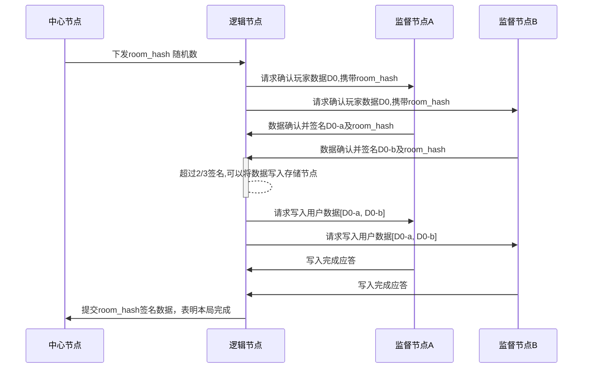

# 概述
Laya.Cloud是一个分布式高速网络，公链的低TPS无法满足类似英雄联盟和王者荣耀等游戏
Laya.Cloud可以将王者荣耀部署在以太坊上。
实现逻辑节点和监督节点逻辑，运行游戏主逻辑。  
每台物理机器可以运行多个node，每个node均包含逻辑节点和监督节点功能。


#  客户登录大厅及游戏房间时序图


# 监督节点确认时序图


# 安装

```
$ git clone  ssh://git@gitlab.layabox.com:10022/litao/layacloud-node.git --recursive
```
如果上述命令执行后，没有创建lib/common目录，则手工添加submodule:
```
git submodule add ssh://git@gitlab.layabox.com:10022/zonghai/layacloud-common.git lib/common
```

```
$ npm install
$ git submodule update --init --recursive
$ cd ./lib/common
$ npm install
$ cd ../..
$ node app.js -h
```

定期更新submodule代码 
```
$ cd layacloud-node
$ git submodule foreach git pull

```

# 与客户端交易
与客户端采用websockets进行交互


# P2P节点交互
节点之间采用http进行交互

# 备注
参考 module.js 实现：
https://github.com/nodejs/node-v0.x-archive/blob/master/lib/module.js


## Docker 

### 下载和启动Docker

下载Mac或Windows版本
https://www.docker.com/products/docker-desktop

ubuntu版本  
```
$ sudo apt install docker.io
$ sudo curl -L https://github.com/docker/compose/releases/download/1.11.1/docker-compose-`uname -s`-`uname -m` > /usr/local/bin/docker-compose
$ sudo chmod +x /usr/local/bin/docker-compose
$ docker-compose -v
docker-compose version 1.11.1, build 7c5d5e4
```


### 准备基本Image

- node:10.8.0-alpine
```bash
    docker pull node:10.8.0-alpine
```

- node:9.8.0-alpine 

用于layacloud-center 项目需要nodejs version <= 9.8.0

```bash
    docker pull node:9.8.0-alpine
```

下载后可以用一下命令检查
```bash
    docker images
输出    
    node     10.8.0-alpine       5a519d1e3a24        2 weeks ago         70.3MB
    node     9.8.0-alpine        4a6857f6f75d        5 months ago        68.4MB
```

### 创建测试网络interface

列出docker 网络
```bash
    docker network ls
    
    NETWORK ID          NAME                   DRIVER              SCOPE
    e46eed88b310        bridge                 bridge              local
    9af5d42cbdb3        host                   host                local
    43e443f8ed01        none                   null                local

```
创建测试网络： layacloud-local-test

```bash
    docker network create layacloud-local-test --driver bridge
    
    docker network ls
    
    NETWORK ID          NAME                   DRIVER              SCOPE
    e46eed88b310        bridge                 bridge              local
    9af5d42cbdb3        host                   host                local
    c6f21fab182a        layacloud-local-test   bridge              local
    43e443f8ed01        none                   null                local
```

### 启动layacloud-center 项目

```bash
    cd layacloud-center 
    docker-compose up
    
```

第一次启动的时候， docker 会编译image。


### 启动layacloud-node 项目

```bash
    cd layacloud-node
    docker-compose up --scale layanode=N
    
```

第一次启动的时候， docker 会编译image。 N 可以指定启动的节点个数。


### 手动启动一个layacloud-node 节点

当执行完docker-compose up 后， docker会编译一个新的image， 可以通过一下命令查询：

```bash
    docker images
    
    layacloud-node_layanode       latest              3cfed1a318c1        19 hours ago        381MB
    layacloud-center_layacenter   latest              a2dd510508d8        21 hours ago        398MB
    node                          10.8.0-alpine       5a519d1e3a24        2 weeks ago         70.3MB
    node                          9.8.0-alpine        4a6857f6f75d        5 months ago        68.4MB
    
```

前两项是新编译的image， 可以通过一下命令手动启动一个节点

```bash
    docker run -ti --rm layacloud-node_layanode:latest sh
   
<进入docker 运行环境>    
   /layacloud-node 
   ./dev.sh
```
---

## 在本机调试过程中的Docker使用说明 

### 已上传到Docker Hub的镜像

- tyrande000/layanode-zq:latest

用于layanode项目，用于每次更改代码Rebuild镜像时的基础镜像，已包含各种代码库

- tyrande000/layacenter-zq:latest

用于layacenter项目，用于每次更改代码Rebuild镜像时的基础镜像，已包含各种代码库

### Layanode编译和启动

- 编译方法（如有代码修改）
```bash
	#用于生成 layacloud-node_layanode，该镜像包含node代码
	docker-compose build
```

- 启动方法
```bash
	#启动10个节点
	docker-compose up --scale layanode=10
	
	#拉皮条节点，暴露主机8656端口，供五子棋项目可以访问本地端口
	docker run -p 8656:8656 --network layacloud-local-test layacloud-node_layanode --url http://172.18.0.2:9001(本人机器上Center IP)
```

### Layacenter编译和启动

- 编译方法（如有代码修改）
```bash
	#用于生成layacloud-center_layacenter，该镜像包含center代码
	docker-compose build
```

- 启动方法
```bash
	#暴露9001端口，给浏览器观察数据用
	docker run -p9001:9001 --network layacloud-local-test layacloud-center_layacenter
```


---

# 案例

Laya.Cloud提供了一个五子棋的案例，来演示Laya.Cloud高速分布式网络的工作流程

# 说明
设定五子棋游戏相关协议，采用websocket进行通讯。

房间切换流程图  


## 客户端到node消息

---
### room.join
加入房间
```
{
  "gameid": string,
  "roomname": string,
  "userid": string,
  "token": string
}
```
- gameid
游戏的id
- roomname  
房间的标识
- userid 
用户的id
- token
登录对应的token

---
### room.leave
离开房间
```
{"reason": reason}
```

---
### user.match
用户开始匹配对手  
请求：  
```
{"roomtype": roomtype}
```
应答：
```
{
  "master": string,
  "serverid" : string
}
```

---
### room.startgame
开始游戏
```
{}
```

---
### room.syncopt
发送帧同步命令
```
{
  "item": array,
  "data": string
}
```
- item  
本帧消耗的道具列表
- data  
本帧提交的数据

---
### room.evt
用户自定义事件
```
{
  "自定义key": "自定义值"
}
```

## 客户端收到的广播消息
---
### start
开始游戏广播
```
{
  "cmd": "start",
  "step": int,
  "players": [
    {
      "userid": string,
      "nickname": string      
    }
  ]
}
```
- cmd  
命令类型
- step  
游戏总步数  
- players  
玩家列表  
  - userid 玩家id
  - nickname 玩家昵称

---
### put
放置棋子
```
{
  "userid": string,
  "step": int,
  "x": int,
  "y": int
}
```
- userid  
用户id
- step  
用户对应的步数
- x  
放置的x坐标  
- y  
放置的y坐标 

---
### win
```
{
  "userid": string
}
```
- userid
获胜的用户id

