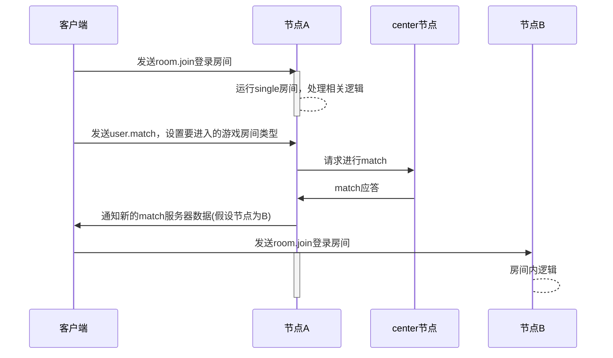
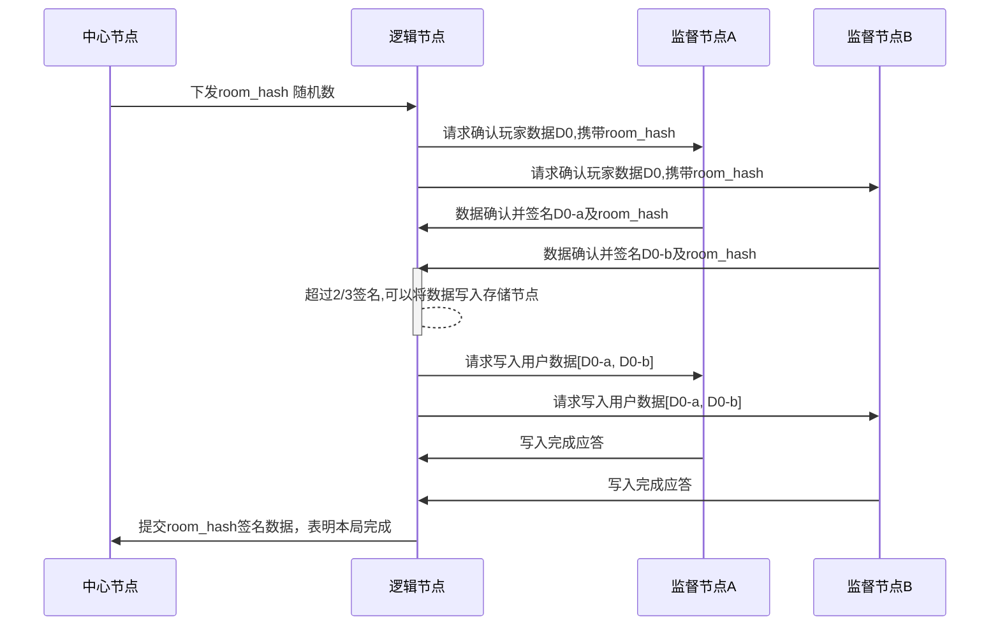

#  客户登录大厅及游戏房间时序图

```mermaid
sequenceDiagram
  客户端 ->> 节点A: 发送room.join登录房间
  activate 节点A
  节点A --> 节点A: 运行single房间，处理相关逻辑
  deactivate 节点A
  客户端 ->> 节点A: 发送user.match，设置要进入的游戏房间类型
  节点A ->> center节点: 请求进行match
  center节点 ->> 节点A: match应答
  节点A ->> 客户端: 通知新的match服务器数据(假设节点为B)
  客户端 ->> 节点B: 发送room.join登录房间
  activate 节点A
  节点B --> 节点B: 房间内逻辑
  deactivate 节点A
```

# 监督节点确认时序图

```mermaid 
sequenceDiagram 
  中心节点 ->> 逻辑节点: 下发room_hash 随机数
  逻辑节点 ->> 监督节点A: 请求确认玩家数据D0,携带room_hash
  逻辑节点 ->> 监督节点B: 请求确认玩家数据D0,携带room_hash
  监督节点A ->> 逻辑节点: 数据确认并签名D0-a及room_hash
  监督节点B ->> 逻辑节点: 数据确认并签名D0-b及room_hash
  activate 逻辑节点
  逻辑节点 --> 逻辑节点: 超过2/3签名,可以将数据写入存储节点
  deactivate 逻辑节点
  逻辑节点 ->> 监督节点A: 请求写入用户数据[D0-a, D0-b]
  逻辑节点 ->> 监督节点B: 请求写入用户数据[D0-a, D0-b]
  监督节点A->> 逻辑节点 : 写入完成应答
  监督节点B->> 逻辑节点 : 写入完成应答
  逻辑节点 ->> 中心节点: 提交room_hash签名数据，表明本局完成

```