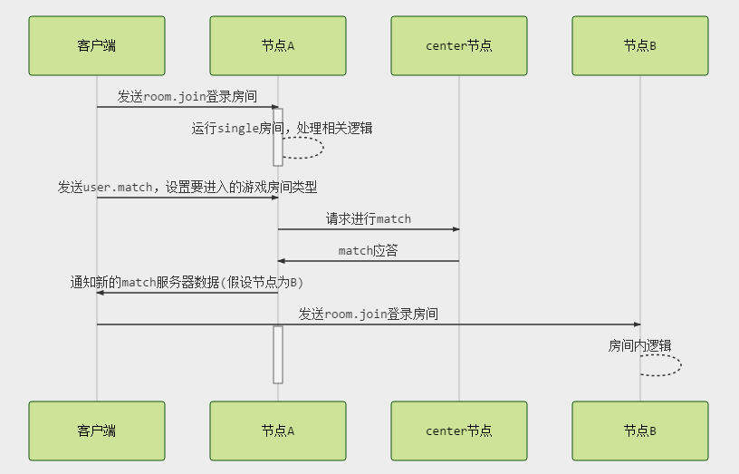

# 说明
设定五子棋游戏相关协议，采用websocket进行通讯。

房间切换流程图  


## 客户端到node消息

---
### room.join
加入房间
```
{
  "gameid": string,
  "roomname": string,
  "userid": string,
  "token": string
}
```
- gameid
游戏的id
- roomname  
房间的标识
- userid 
用户的id
- token
登录对应的token

---
### room.leave
离开房间
```
{"reason": reason}
```

---
### user.match
用户开始匹配对手  
请求：  
```
{"roomtype": roomtype}
```
应答：
```
{
  "master": string,
  "serverid" : string
}
```

---
### room.startgame
开始游戏
```
{}
```

---
### room.syncopt
发送帧同步命令
```
{
  "item": array,
  "data": string
}
```
- item  
本帧消耗的道具列表
- data  
本帧提交的数据

---
### room.evt
用户自定义事件
```
{
  "自定义key": "自定义值"
}
```

## 客户端收到的广播消息
---
### start
开始游戏广播
```
{
  "cmd": "start",
  "step": int,
  "players": [
    {
      "userid": string,
      "nickname": string      
    }
  ]
}
```
- cmd  
命令类型
- step  
游戏总步数  
- players  
玩家列表  
  - userid 玩家id
  - nickname 玩家昵称

---
### put
放置棋子
```
{
  "userid": string,
  "step": int,
  "x": int,
  "y": int
}
```
- userid  
用户id
- step  
用户对应的步数
- x  
放置的x坐标  
- y  
放置的y坐标 

---
### win
```
{
  "userid": string
}
```
- userid
获胜的用户id

